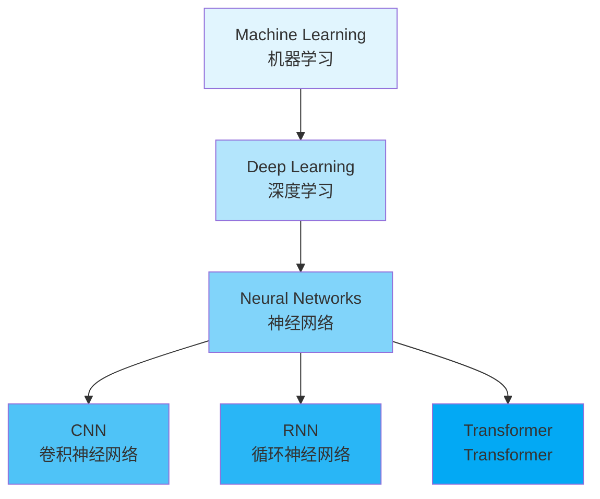

# I2DL 课程索引

> Introduction to Deep Learning - TU Munich 深度学习导论课程

## 课程信息

| 项目       | 内容                                   |
| -------- | ------------------------------------ |
| **课程名称** | Introduction to Deep Learning (I2DL) |
| **授课机构** | TU Munich (慕尼黑工业大学)                  |
| **学分**   | 8 CP                                 |
| **评估方式** | 笔试 (40%) + 编程作业 (60%)                |

## 讲义列表

| 编号 | 讲义名称 | 摘要 |
|------|----------|------|
| L01 | [[summaries/I2DL-Lecture-1-Introduction]] | 课程介绍、ML 基础、工具环境 |
| L02 | [[summaries/I2DL-Lecture-2-Linear]] | 线性回归、MSE 损失、闭式解 |
| L03 | [[summaries/I2DL-Lecture-3-Intro2NN]] | 感知机、MLP、激活函数 |
| L04 | [[summaries/I2DL-Lecture-4-Optimization]] | 反向传播、链式法则、梯度下降 |
| L05 | [[summaries/I2DL-Lecture-5-Scaling]] | Mini-batch、Adam、BatchNorm |
| L06 | [[summaries/I2DL-Lecture-6-TrainingNN]] | 数据划分、超参调优、Debug |
| L07 | [[summaries/I2DL-Lecture-7-Losses]] | Softmax、Cross-Entropy |
| L08 | [[summaries/I2DL-Lecture-8-Augmentation]] | 数据增强、Dropout、正则化 |
| L09 | [[summaries/I2DL-Lecture-9-ConvNets]] | 卷积、池化、CNN 架构 |
| L10 | [[summaries/I2DL-Lecture-10-Architectures]] | ResNet、EfficientNet |
| L11 | [[summaries/I2DL-Lecture-11-RNNs-Transformers]] | LSTM/GRU、Transformer |
| L12 | [[summaries/I2DL-Lecture-12-Advanced]] | VAE/GAN、GNN、LLM |

> ✅ 12 讲全部完成

## 练习列表

| 编号 | 文件 | 摘要 |
|------|------|------|
| E01 | [[1_raw/articles/I2DL/exercise/exercise_02/summary]] | 环境配置（Anaconda/Colab）、数据集下载、作业提交 |

## 新增资源

| 文件 | 说明 | 状态 |
|------|------|------|
| `References/PATTERN RECOGNITION.pdf` | 模式识别参考书 | ⚠️ 待处理（6.8MB，无法直接读取） |

## 参考资料

- 模式识别经典教材（需手动查看 PDF）

## 核心概念

| 概念 | 说明 | 相关笔记 |
|------|------|----------|
| [[concepts/Deep Learning]] | 深度学习 | 核心概念 |
| [[concepts/Neural Networks]] | 神经网络 | 基础结构 |
| [[concepts/Convolutional Neural Networks]] | 卷积神经网络 | 图像处理 |
| [[concepts/Recurrent Neural Networks]] | 循环神经网络 | 序列数据 |
| [[concepts/Transformers]] | Transformer | Attention 机制 |
| [[concepts/Machine Learning]] | 机器学习 | 上位概念 |

```dataview
TABLE Lecture as "讲义编号", date-created as "创建日期"
FROM "2_wiki/summaries"
WHERE course = "I2DL"
SORT file.name ASC
```

## 概念图谱



## 资源链接

- 课程主页: [TUM Online - I2DL](https://orbit.in.tum.de/course/28/course/816)
- 讲义 PDF: [[1_raw/articles/I2DL/lectures/]]

## 更新记录

- 2026-04-16: 创建索引，导入第一讲内容
- 2026-04-16: 导入 L02-L12 全部 12 讲摘要
- 2026-04-24: 添加练习 E01 摘要，新增 `References/PATTERN RECOGNITION.pdf`（待处理）